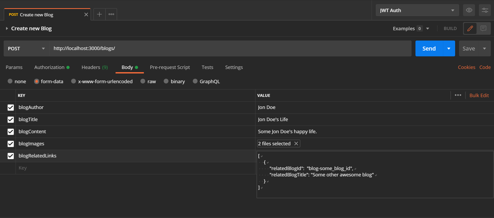

# Feather API

Feather API is a Nodejs Express REST API which provides CRUD functionality of Blogs along with Authentication.

### Base URL

```
https://kipplist.herokuapp.com/
```

## API ENDPOINTS

## Auth 🔐

<p align="center" style="margin: 2rem 0">
  
</p>

```
/auth
```

#### POST - SignUp 😎✨

```
/auth/signUp
```

**POST** request to /auth/signUp with specified body will register new user.

##### Password criteria

- At least 8 characters—the more characters, the better.
- Atleast one uppercase and lowercase letter.
- A mixture of letters and numbers.
- Inclusion of at least one special character from [!, @, #, $, %, ^, &, *]

### Use form-data

```
blogAuthor: Jon Doe

blogTitle: Jon Doe's Life

blogContent: Some Jon Doe's happy life.

blogImages: [Upload Image Files]

blogRelatedLinks:
[
  {
    "relatedBlogId":  "blog-some_blog_id",
    "relatedBlogTitle": "Some other awesome blog"
  }
]

```

Since we're using `form-data` to take input, `form-data` only supports files and text input. If we want to send related links array inside blog, we need to send blogRelatedLinks array as `JSON Array` as text which will be parsed when blog will be created. `JSON Array` must contain relatedLink object as shown below.

```json
{
  "relatedBlogId": "blog-31jnfd2akiupg4k5",
  "relatedBlogTitle": "Some other awesome blog"
}
```

#### POSTMAN Request Example

<p align="center" style="margin: 2rem 0">
  </img>
</p>

#### POST - SignIn 🧐

```
/auth/signIn
```

**POST** request to /auth/signIn with specified body will login new user and set JWT token inside Cookie.

```json
{
  "email": "jondoe@mail.com",
  "password": "JonDoee@123"
}
```

## Blogs

<p align="center" style="margin: 2rem 0">
  
</p>

- ##### For operations with todo endpoint, request header 🔑 must be present with Bearer Token as `authorization` generated using JWT token assigned to user upon signIn.
- ##### This can be done by setting Bearer Token inside `authorization` of `req.headers`.
- ##### If using Postman learn how to set JWT token as Bearer token inside Request header from [here](https://medium.com/@iroshan.du/set-bearer-token-as-environment-variable-in-postman-for-all-apis-13277e3ebd78).

### GET - Fetch Blogs 📀

```
/blogs
```

```
/blogs/?limit=5
```

```
/blogs/?select=blogAuthor+blogContent
```

```
/blogs/?limit=5&select=blogAuthor+blogContent
```

A simple **GET** request on /todos will return all todos in database.

```
/blogs/:id
```

```
/blogs/:id?select=blogAuthor+blogContent
```

**GET** request on /todos with specified id in params will return todos with specific id.

### POST - Create new Blog 💾

```
/blogs
```

**POST** request with valid request body will create new Blog.

##### **todoTitle and todoContent are required\***

#### Request Body - Type form-data

```
blogAuthor : String
blogTitle : String
blogContent: String
blogImages[] : Files
blogRelatedLinks: String[
    {
      "relatedBlogId": "blogId",
      "relatedBlogTitle": "blogTitle"
    }
  ]
```

\***\*Since we are requesting in the form of Form-data we cannot pass blogRelatedLinks as array. Stringify \*\***

### PATCH - Update Blog ⚙️

```
/blogs/:id
```

```
/blogs/:id?select=blogAuthor+blogContent
```

**PATCH** request with specified id in params and request body with specified key value will update specified Blog.

```json
{
  "todoTitle": "PATCH Req",
  "todoContent": "Will update Todo",
  "todoCompleted": true / false
}
```

#### DELETE - Delete Blog ❌

**DELETE** request with specified id will delete the Blog from database.

```
/blogs/:id
```

### Directory Tree

```
.
├── app.js
├── config.env
├── config.sample.env
├── package.json
├── package-lock.json
├── README.md
└── src
    ├── configuration
    │   └── config.js
    ├── controllers
    │   ├── authController.js
    │   └── todoController.js
    ├── data
    │   └── db.json
    ├── helpers
    │   ├── hashString.js
    │   └── jwtTokenFunctions.js
    ├── middlewares
    │   ├── protectRoute.js
    │   ├── responses
    │   │   ├── errorResponse.js
    │   │   └── successResponse.js
    │   └── validations
    │       ├── authValidations.js
    │       └── todoValidations.js
    ├── models
    │   ├── ErrorResponse.js
    │   ├── Todo.js
    │   └── User.js
    └── routes
        ├── authRoutes.js
        └── todoRoutes.js`
```

### Installation

#### Kipplist requires [Node.js](https://nodejs.org/) v12+ to run.

Install the dependencies and devDependencies and start the server.
Create config.env by refering config.sample.env

```sh
$ npm install
$ npm run dev
```

For production environments...

```sh
$ npm install --production
$ NODE_ENV=production npm run start
```

## Heads up

This app uses nodemailer for sending verification emails. App uses Gmail service for sending email.

### Steps

1. Setup app to send emails by setting your gmail email and password inside config.env or by setting environment variables `NODE_MAILER_EMAIL = "youremail@gmail.com"` and `NODE_MAILER_PASSWORD = "yourpassword"`.
2. By default Gmail blocks such services, to enable app to send emails using your account you need to toggle allow less secure apps to ON from [here](http://myaccount.google.com/lesssecureapps). \*\***This option is only available if 2 step verification is off.**

#### POSTMAN Collection

[](https://app.getpostman.com/run-collection/6ee50b3a23ca2d229567)

##### Deployed on Heroku - [https://kipplist.herokuapp.com/](https://kipplist.herokuapp.com/)
