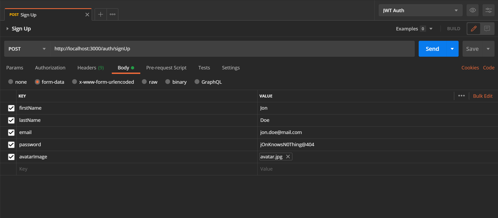
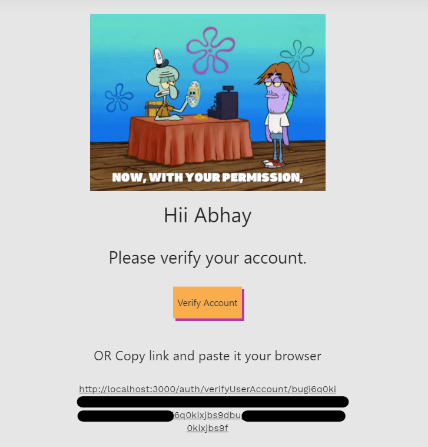
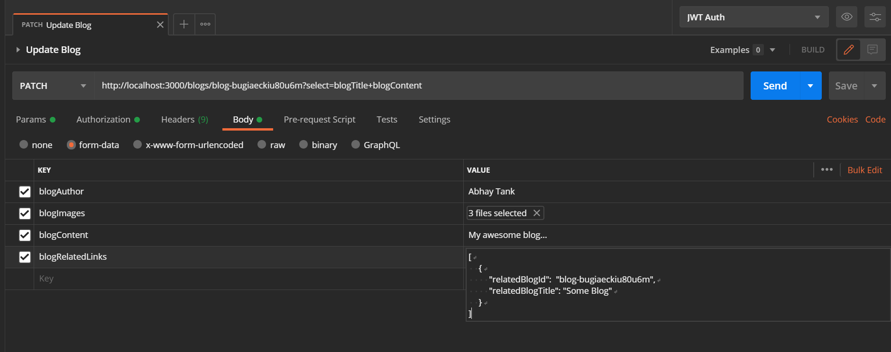

# Feather API

Feather API is a Nodejs Express REST API which provides CRUD functionality of Blogs along with Authentication.

### Base URL

```
https://feather-api.herokuapp.com/
```

## API ENDPOINTS

## Auth 🔐

<p align="center" style="margin: 2rem 0">
  
</p>

```
/auth
```

# POST - SignUp 😎✨

```
/auth/signUp
```

> **POST** Request to `/auth/signUp` with specified body will register new user.

## Password criteria

- At least 8 characters—the more characters, the better.
- Atleast one uppercase and lowercase letter.
- A mixture of letters and numbers.
- Inclusion of at least one special character from [!, @, #, $, %, ^, &, *]

### Use form-data to send request.

`key : value`

```
firstName: Jon

lastName: Doe

email: jon.doe@mail.com

password: jOnKnowsN0Thing@404

avatarImage: avatar.png

```

#### POSTMAN Request Example

<p align="center">
  </img>
</p>

### **After Sign up** ❕❕❕

- ### A verification mail will be sent to user on his/her email address
- ### User will be **not allowed** to **sign in** if he/she has not visited the **verification link** sent to him/her by Verification email.
- ### For testing purpose use [temp mails](https://temp-mail.org/en/).
- ### Once user has visited the Verification URL, his/her token will be verified and `accountVerified` will be toggled to `true`.

<p align="center">
  </img>
</p>
  <br>

# POST - SignIn 🧐

```
/auth/signIn
```

> **POST** Request to `/auth/signIn` with specified body will login new user and set JWT token inside Cookie.

### Use form-data to send request.

`key : value`

```

email: jon.doe@mail.com

password: jOnKnowsN0Thing@404

```

<br>

# Sign Out ⭕️

```
/auth/signOut
```

> **GET** Request to `/auth/signOut` with Bearer Token inside `authorization` of `req.headers` will sign out user and unset `JWT` inside cookie.

<br>

# Send Verification Email 📧

```
/auth/sendVerificationEmail/:userId
```

> If missed or not recieved verification email, **GET** Request on `/auth/sendVerificationEmail/:userId` will send verification email to user email.

<br>

# Verify User Token ✅

```
/auth/verifyUserAccount/:verificationToken
```

> **GET** Request on `/auth/verifyUserAccount/:verificationToken` will verify user and toggle `accountVerified` to `true`.
> This is automatically done when user clicks on `Verify Account` in verification email.

<br><br>

# Blogs

<p align="center" style="margin: 2rem 0">
  
</p>

- ### For operations with `/blogs` endpoint, Request header 🔑 must be present with `Bearer Token` as _authorization_ generated using JWT token assigned to user upon signIn.
- ### This can be done by setting Bearer Token inside `authorization` of `req.headers`.
- ### If using Postman learn how to set JWT token as Bearer token inside Request header from [here](https://medium.com/@iroshan.du/set-bearer-token-as-environment-variable-in-postman-for-all-apis-13277e3ebd78).

<br><br>

# GET - Fetch Blogs 💿

```
/blogs
```

> A simple **GET** Request on `/blogs` will fetch by default upto 10 blogs from database.

<br>

```
/blogs/?limit=5
```

> `limit` can be used to fetch **`N`** number of blogs.

```
/blogs/?select=blogAuthor+blogContent
```

> `select` query can be used to fetch only specified data.

```
/blogs/?limit=5&select=blogAuthor+blogContent
```

> Both features can be used in combination as above.

# Get Blog by blogId

```
/blogs/:id
```

```
/blogs/:id?select=blogAuthor+blogContent
```

> **GET** Request on `/blogs/:id` with specified id as params will return blog with specific id.

# POST - Create new Blog 💾

```
/blogs
```

> **POST** Request with valid request body will create new Blog.

### **`blogAuthor`, `blogTitle` and `blogContent` are required.**

### Use form-data to send request.

`key : value`

```
blogAuthor: Jon Doe

blogTitle: Jon Doe's Life

blogContent: Some Jon Doe's happy life.

blogImages: [Upload Image Files]

blogRelatedLinks:
[
  {
    "relatedBlogId":  "blog-some_blog_id",
    "relatedBlogTitle": "Some other awesome blog"
  }
]

```

Since we're using `form-data` to take input, `form-data` only supports files and text input. If we want to send related links array inside blog, we need to send blogRelatedLinks array as `JSON Array` as text which will be parsed when blog will be created. `JSON Array` must contain relatedLink object as shown below.

```json
{
	"relatedBlogId": "blog-31jnfd2akiupg4k5",
	"relatedBlogTitle": "Some other awesome blog"
}
```

#### POSTMAN Request Example

<p align="center">
  </img>
</p>

# PATCH - Update Blog ⚙️

```
/blogs/:id
```

> **PATCH** Request with specified id in params and request body with specified key value will update specified Blog.

### Related links and images will be **overwritten** if older links/files are not provided.

### Use form-data to send request.

`key : value`

```
blogTitle: Jon Doe's new Life

blogContent: Some Jon Doe's happy new life.

blogImages: [Upload Image Files]

blogRelatedLinks:
[
  {
    "relatedBlogId":  "blog-some_blog_id",
    "relatedBlogTitle": "Some other awesome blog"
  }
]

```

#### POSTMAN Request Example

<p align="center">
  </img>
</p>

```
/blogs/:id?select=blogAuthor+blogContent
```

> `select` query can be used to fetch only specified data.

<br><br>

# DELETE - Delete Blog ❌

```
/blogs/:id
```

> **DELETE** Request with specified id will delete the Blog from database.

<br>

<br><br>

# Project Structure 📁

```
.
├── app.js
├── config.env
├── config.sample.env
├── package.json
├── package-lock.json
├── README.md
├── resources
│   ├── blogs
│   └── users
├── src
│   └── api-v1
│       ├── configuration
│       │   └── config.js
│       ├── controllers
│       │   ├── authController.js
│       │   └── blogsController.js
│       ├── helpers
│       │   ├── jwtFunctions.js
│       │   └── sendVerificationEmail.js
│       ├── middlewares
│       │   ├── authIsUserSignedIn.js
│       │   ├── createBlogId.js
│       │   ├── createUserId.js
│       │   ├── protectRoute.js
│       │   ├── responses
│       │   │   ├── sendErrorResponse.js
│       │   │   └── sendSuccessResponse.js
│       │   ├── uploadBlogImages.js
│       │   └── uploadUserAvatarImage.js
│       ├── models
│       │   ├── Blog.js
│       │   ├── ErrorResponse.js
│       │   └── User.js
│       ├── routes
│       │   ├── authRoutes.js
│       │   └── blogsRoutes.js
│       └── validations
│           ├── blogSchemaValidations.js
│           └── userSchemaValidations.js
└── todos.txt
```

<br><br>

# Installation

#### Feather API requires [Node.js](https://nodejs.org/) v12+ to run.

Install the dependencies and devDependencies and start the server.
Create config.env by refering config.sample.env

```sh
$ npm install
$ npm run dev
```

For production environments...

```sh
$ npm install --production
$ NODE_ENV=production npm run start
```

# Heads up ⚠️

This app uses `nodemailer` for sending verification emails. App uses Gmail service for sending email.

### Steps

1. Setup app to send emails by setting your gmail email and password inside config.env or by setting environment variables `NODE_MAILER_EMAIL = "youremail@gmail.com"` and `NODE_MAILER_PASSWORD = "yourpassword"`.
2. By default Gmail blocks such services, to enable app to send emails using your account you need to toggle allow less secure apps to ON from [here](http://myaccount.google.com/lesssecureapps). \*\***This option is only available if 2 step verification is off.**
   <br><br><br>

#### POSTMAN Collection

[](https://app.getpostman.com/run-collection/c72dbc4eb14e3fa52dd0#?env%5BJWT%20Auth%5D=W3sia2V5Ijoiand0IiwidmFsdWUiOiIiLCJlbmFibGVkIjp0cnVlfV0=)

#### Deployed on Heroku - [https://kipplist.herokuapp.com/](https://kipplist.herokuapp.com/)
